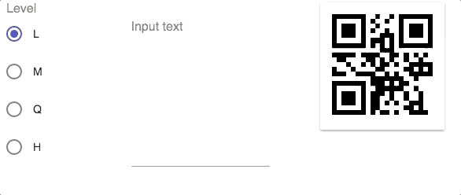

# Real-time QR code genrator

</img>

## Demo page

https://nwtgck.github.io/qrcode-typescript-react

## How to run

```sh
$ cd <this-repo>
$ npm install
$ npm start
```

Then go to http://localhost:8080

## How to build 

```sh
$ cd <this-repo>
$ npm install
$ npm build
```

Then you can open ./build/index.html in your browser.

## Main technologies

* TypeScript
* React
